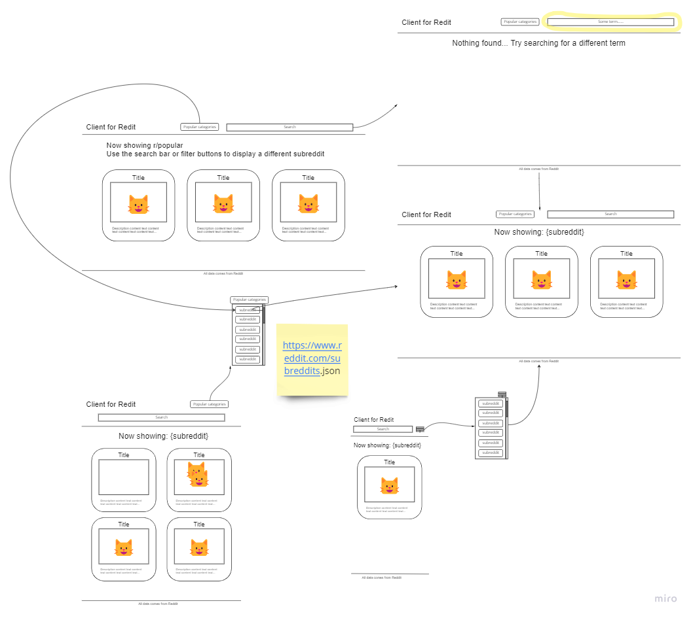

# Client for Reddit
This is a Codecademy.com practice project from Front-end Engineer path (Portfolio Project: Reddit Client).

## Wireframe

## Technologies used
The project uses the following technologies:
a) frameworks:
    - React
    - Redux
b) testing:
    - Enzyme
    - Jest
c) version control and publishing:
    - GitHub
    - Netlify.com

## Features
The project is a Reddit client, which displays the latests posts in the most popular subreddits.

## Future work
The following work is planned:
- searchbar
- popular category filters